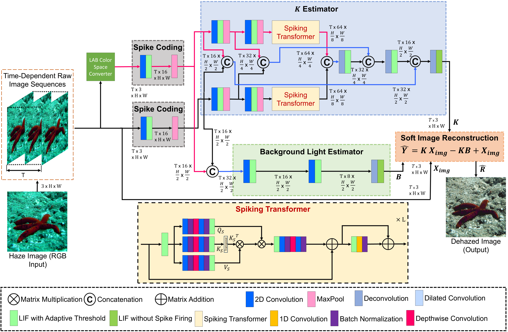
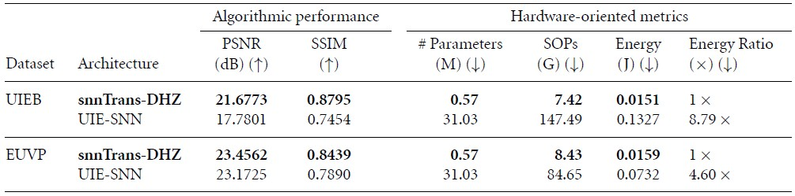

# Spiking transformer with learnable threshold mechanism for underwater image dehazing to aid vision-based navigation


**Published in Neuromorphic Computing and Engineering (2026)**

This repository contains the implementation of **snnTrans-DHZ**, a lightweight spiking-transformer framework for **underwater image dehazing**. The method introduces a **learnable threshold membrane potential mechanism** to improve temporal dynamics and memory retention in spiking neural processing, while preserving computational efficiency for deployment-oriented vision systems.

The framework is designed to address underwater image degradation caused by haze, scattering, absorption, color distortion, and reduced visibility. It combines **spiking neural computation**, **transformer-based feature extraction**, and **hybrid RGB-LAB processing** to produce visibility-enhanced underwater images suitable for downstream robotic perception and vision-based navigation.

---

## Key Contributions

- **🧠 Learnable threshold spiking neurons:** Introduces **LTMP-LIF** neurons, enabling adaptive threshold membrane potential dynamics during backpropagation for improved temporal modeling.

- **🌊 Underwater image dehazing with spiking transformers:** Proposes **snnTrans-DHZ**, a lightweight transformer-integrated SNN architecture tailored to underwater image enhancemnet.

- **🎨 Hybrid RGB-LAB processing:** Uses joint RGB-LAB feature representations to better separate luminance and chromaticity information for improved haze removal and color recovery.

- **📉 Lightweight and efficient:** Achieves comparable performance with only **0.5670M parameters**, **7.42 GSOPs**, and **0.151 J** energy consumption.

- **📊 Strong benchmark results:** Evaluated on **UIEB** and **EUVP**, achieving competitive restoration quality with improved energy efficiency.

- **🤖 Robotics relevance:** Suitable for underwater robotics, environmental monitoring, and vision-based navigation in degraded marine environments.

---

## System Overview

<p align="center">  </p> <p align="center"> <em>Overview of the proposed snnTrans-DHZ architecture.</em> </p>

The proposed **snnTrans-DHZ** architecture is built around three main modules:

- **K Estimator module:** extracts features from different color space representations.  
- **Background light estimator module:** jointly estimates the background light component from RGB-LAB features.  
- **Soft image reconstruction module:** reconstructs haze-free, visibility-enhanced underwater images.  

Underwater images are first transformed into **time-dependent sequences**, then represented in **LAB color space**, and finally processed through the spiking-transformer framework using **surrogate gradient-based backpropagation through time**.

## Efficiency

- **Parameters:** 0.5670M  
- **Computational cost:** 7.42 GSOPs  
- **Energy consumption:** 0.151 J  
- **Energy efficiency improvement:** 3.3× over the lightest transformer-based state-of-the-art baseline  

<p align="center">
  
</p>
<p align="center">
  <em>Performance evaluation with state-of-the-art spiking based underwater image enhancement method.</em>
</p>

## Qualitative Results

<p align="center">
  
</p>
<p align="center">
  <em>Qualitative comparison on various underwater scenes.</em>
</p>

---
## Getting Started
**Repository Structure**:

```bash
.
├── checkpoints/        # Saved model checkpoints
├── data/               # Training / testing data
├── dehazed_images/     # Output restored images
├── .gitattributes
├── dataset_rgblab.py   # Dataset preparation
├── README.md
├── snntrans_model.py   # Model architecture
├── snntrans_test.py    # Inference script
└── snntrans_train.py   # Training script
```
For installation, setup, and usage, please use the training and testing scripts provided in the repository. 

**Requirements**:
- Python 3.8+
- PyTorch
- Additional dependencies listed in requirements.txt

Install dependencies with:
```bash
pip install -r requirements.txt
```

**Training**:
```bash
python snntrans_train.py
```

**Inference**:
```bash
python snntrans_test.py
```

**Notes**:
- Pretrained checkpoints are placed in `./checkpoints/`
- Dehazed outputs are saved in `./dehazed_images/`

## Datasets

The model is trained and evaluated on the following public underwater benchmarks: (i) [UIEB](https://li-chongyi.github.io/proj_benchmark.html) and (ii) [EUVP](https://irvlab.cs.umn.edu/resources/euvp-dataset). Please update dataset paths inside the scripts according to your local setup.

## Citation
If you find this work useful in your research, please cite:
```
@article{Sudevan2026snnTransDHZ,
  title={Spiking transformer with learnable threshold mechanism for underwater image dehazing to aid vision-based navigation},
  author={Sudevan, Vidya and Kausar, Rizwana and Javed, Sajid and Karki, Hamad and De Masi, Giulia and Dias, Jorge},
  journal={Neuromorphic Computing and Engineering},
  volume={6},
  number={1},
  pages={014010},
  year={2026},
  doi={10.1088/2634-4386/ae41e1}
}
```
For further help or clarification required, please contact `vidyarejul@gmail.com/ vidya.sudevan@ku.ac.ae`

## Thanks
Our implementation are based on [Spike-Driven-Transformer-V2](https://github.com/BICLab/Spike-Driven-Transformer-V2) and [SpikingJelly](https://spikingjelly.readthedocs.io/zh-cn/latest/tutorials/en/spikformer.html) tutorials. We gratefully thank the authors for their wonderful contributions.
